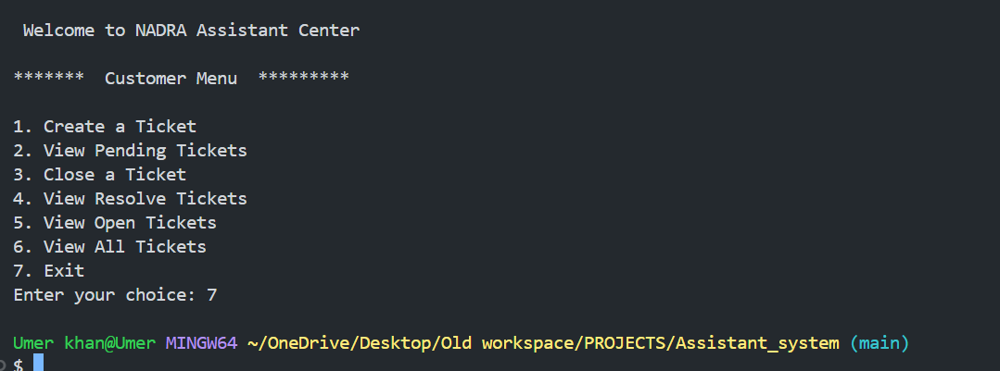
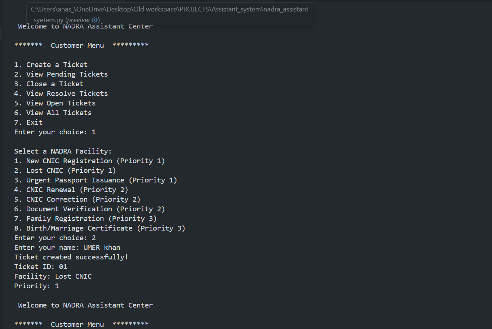
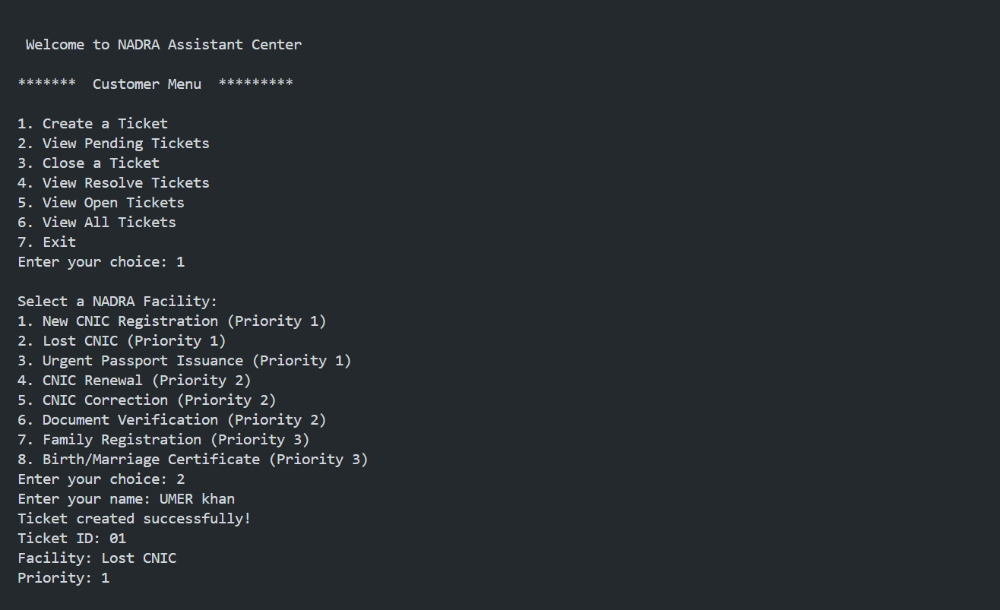
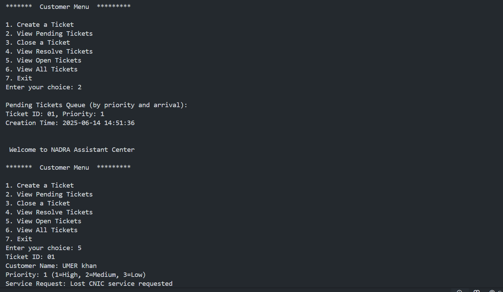
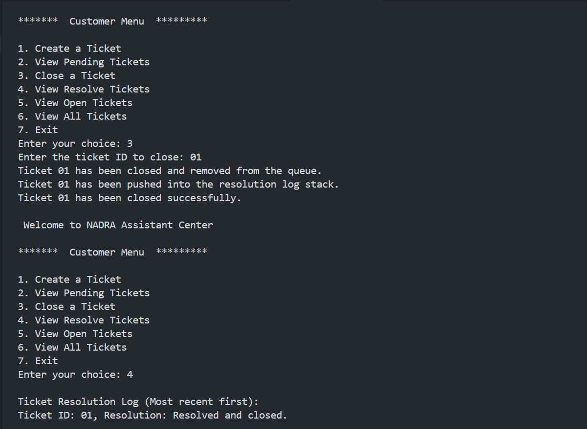
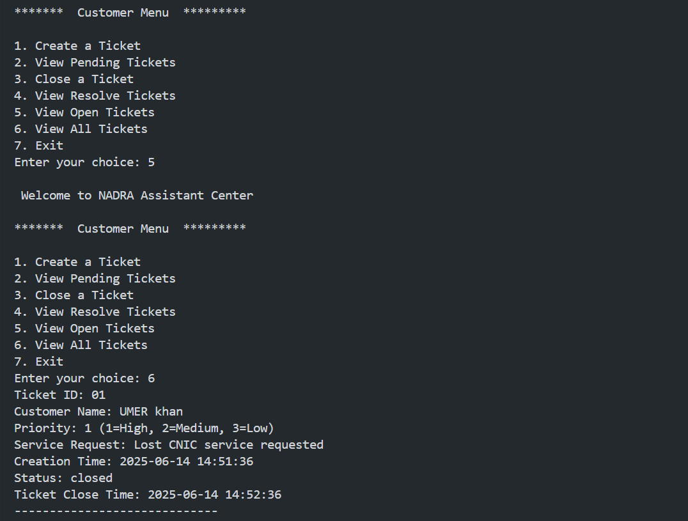

# 🇵🇰 NADRA Assistant Center – Ticket Management System

A console-based ticketing system simulating a **real-world NADRA (National Database and Registration Authority)** service center. This project manages customer service requests using core **Data Structures** like Linked Lists, Queues, and Stacks in Python.

---

## 📌 Features

- 📥 **Create Tickets** for different NADRA services with assigned priority
- 📊 **Display Pending Tickets** based on priority and request time
- ✅ **Close Tickets** and store them in a resolution log (stack)
- 🔁 **View All / Open / Closed Tickets** with timestamps
- 📚 Educational simulation of a **real-life queue system**

---

## 🧠 Data Structures Used

| Component                    | Data Structure |
|-----------------------------|----------------|
| Ticket List                 | Singly Linked List |
| Pending Ticket Queue        | Priority Queue (linked) |
| Ticket Resolution Log       | Stack |
| Time Stamps (open/close)    | `datetime` module |

---

## ⚙️ Services Offered (Simulated)

1. New CNIC Registration (High)
2. Lost CNIC (High)
3. Urgent Passport Issuance (High)
4. CNIC Renewal (Medium)
5. CNIC Correction (Medium)
6. Document Verification (Medium)
7. Family Registration (Low)
8. Birth/Marriage Certificate (Low)

Each option is assigned a **priority level**:  
`1 = High`, `2 = Medium`, `3 = Low`

---

## SCREENSHOTS 

 
   
  
  
 

